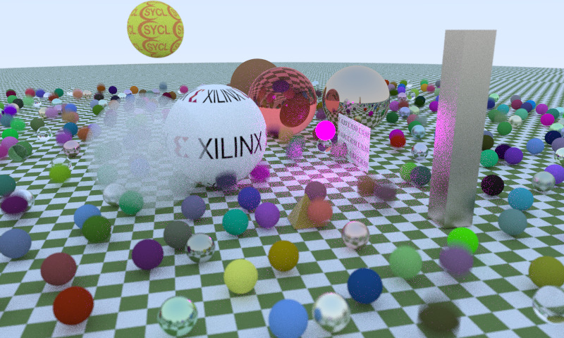

# Path tracer

This is an experimental path tracer using C++20 and SYCL for
acceleration.



This is using triSYCL for now but it might work even better on some
other SYCL implementations. Contributions and optimizations welcome!

The main focus here is to replace classic features like pointers or
dynamic polymorphism that does not work (well) on heterogeneous with
more modern constructs such as `std::variant` and `std::visit`.

## Features

- motion blur;
- depth of field;
- materials:
  - smoke;
  - textures;
  - Lambertian material;
  - dielectric material;
  - metallic roughness;
  - light;
- geometry:
  - spheres;
  - triangles;
  - x/y/z-rectangles;
  - boxes;

## Compiling

Clone the reposity such as with:
```sh
git clone git@github.com:triSYCL/path_tracer.git
```

Create a `build` directory for example inside the cloned repository
and jump into it.

From there, assuming you have the https://github.com/triSYCL/triSYCL
repository somewhere, run:
```sh
cmake .. -DCMAKE_MODULE_PATH=.../triSYCL/cmake
```
Build the project with:
```sh
cmake --build .
```
This creates the executable.


## Running

Now you can run the path tracer with:
```sh
time RT_SYCL/sycl-rt >! result.ppm
```
This results in the image ``result.ppm`` produced by the path tracer.


## Bibliography

Some references that were tremendously useful in writing this project:

1. [Path tracing](https://en.wikipedia.org/wiki/Path_tracing)

2. [Ray Tracing in One Weekend - Peter
Shirley](https://raytracing.github.io/books/RayTracingInOneWeekend.html)

3. [Ray Tracing: The Next Week - Peter
Shirley](https://raytracing.github.io/books/RayTracingTheNextWeek.html)

4. [Ray-tracing in a Weekend with SYCL: Basic sphere tracing -- Georgi
Mirazchiyski](https://www.codeplay.com/portal/blogs/2020/05/19/ray-tracing-in-a-weekend-with-sycl-basic-sphere-tracing.html)

5. [Ray-tracing in a Weekend with SYCL Part 2: Pixel sampling and
   Material tracing -- Georgi
   Mirazchiyski](https://www.codeplay.com/portal/blogs/2020/06/19/ray-tracing-in-a-weekend-with-sycl-part-2-pixel-sampling-and-material-tracing.html)

6. [CppCon 2018: Mateusz Pusz, “Effective replacement of dynamic
    polymorphism with
    std::variant”](https://www.youtube.com/watch?v=gKbORJtnVu8)

7. [Bartek's coding blog: Runtime Polymorphism with std::variant and
   std::visit](https://www.bfilipek.com/2020/04/variant-virtual-polymorphism.html)

8. [Intersection of a Ray/Segment with a
   Triangle](http://geomalgorithms.com/a06-_intersect-2.html)
